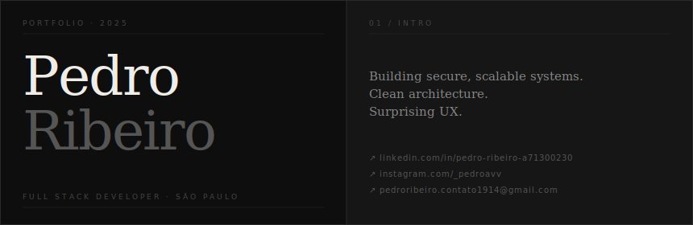

<br/>

```
Currently   → Full Stack projects
Studying    → Software architecture & new technologies
Focus       → React · Next.js · Node.js
```

<br/>

## Work

&nbsp;`01` &nbsp;**Babilon** &nbsp;— Personal financial control system inspired by *The Richest Man in Babylon* &nbsp;&nbsp;`React` `TypeScript` `Supabase`

&nbsp;`02` &nbsp;**ShopSphere** &nbsp;— Complete e-commerce platform: search, cart and payment processing &nbsp;&nbsp;`React` `Node.js` `PostgreSQL`

&nbsp;`03` &nbsp;**Stratix** &nbsp;— Task management and productivity system built for real workflows &nbsp;&nbsp;`React` `Node.js` `Prisma`

&nbsp;`04` &nbsp;**Palazzo Travel** &nbsp;— Travel package management with robust, scalable architecture &nbsp;&nbsp;`React` `TypeORM` `PostgreSQL`

<br/>

<div align="right"><a href="https://github.com/pedroavv1914?tab=repositories">all repositories →</a></div>

---

**Frontend** &nbsp;&nbsp; React · Next.js · TypeScript · TailwindCSS

**Backend** &nbsp;&nbsp;&nbsp; Node.js · Python · C# · Java

**Database** &nbsp;&nbsp; PostgreSQL · MongoDB · Prisma · TypeORM

**Infra** &nbsp;&nbsp;&nbsp;&nbsp;&nbsp;&nbsp;&nbsp; Docker · AWS · Git · Supabase

---

<div align="center">


&nbsp;&nbsp;


</div>

<br/>

<div align="center">
<sub>São Paulo, Brazil &nbsp;·&nbsp; github.com/pedroavv1914</sub>
</div>
